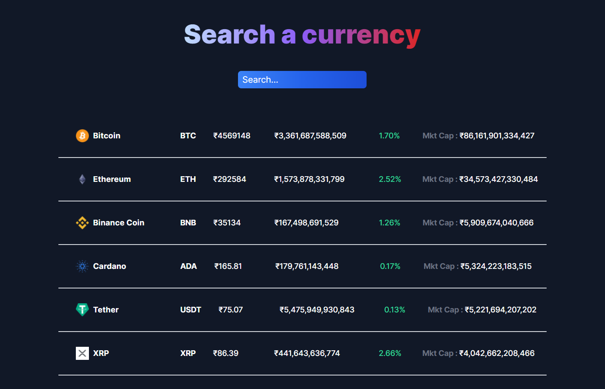

# Cryptocurrency Tracker

A Cryptocurrency finance price tracking application created using React and TailwindCSS. The Javascript library, Axios, facilitates asynchronous HTTP requests from a web browser or Node.js server to obtain currency-related data and retrieve corresponding results. Also, the prices are dynamically updated with each page refresh, sourcing information from a public API.

## Live Website

https://cryptocurrency-tracker-react-v1.netlify.app/

## Features

- HTTP Requests on Browser Functionality(Axios)
- Live update once refreshed

### Screenshots



## Table of Contents

- [Installation](#installation)
- [Usage](#usage)
- [Target Audience](#target-audience)

## Installation

Follow these steps to install and run the project on your local machine:

### Prerequisites

Before you begin, ensure you have met the following requirements:

- **Node.js**: [Install Node.js](https://nodejs.org/)
- **npm (Node Package Manager)**: Included with Node.js

### Clone the Repository

1. Clone this repository to your local machine using the following command:

   ```bash
   git clone https://github.com/Sadhvi10/cryptocurrency-tracker.git

### Start the development server

2. Install npm and start the development server (localhost:3000) using the following command:

   ```bash
   npm i && npm run start

## Usage

1. **Real-Time Monitoring**: Cryptocurrency prices are notoriously volatile. A tracking app allows users to monitor prices in real time, making informed decisions about buying or selling.
2. **Asynchronous Operations & Error Handling by Axios**: Axios allows the app to perform non-blocking operations, ensuring the user interface remains responsive even when fetching data. Axios provides comprehensive error handling, essential when dealing with real-time financial data.
3. **Integration with External APIs**: Most cryptocurrency data is fetched from external sources. Axios simplifies the process of connecting to these external APIs, ensuring the app always displays up-to-date information.

In summary, a cryptocurrency finance tracking app is required for real-time insights into the crypto market. 

## Target Audience

Below are the few targeted audiences for the application but not limited to :

- Cryptocurrency Investors: Individuals who have invested in cryptocurrencies and need to monitor the value of their investments in real-time.
- Day Traders: Those who buy and sell cryptocurrencies on a daily basis to capitalize on short-term fluctuations in their prices.
- Educational Institutions: Universities and colleges offering courses on blockchain and cryptocurrency might use such apps as teaching tools.
- Financial Analysts: Professionals who analyze cryptocurrency markets for various purposes, including advising clients, writing reports, or making investment decisions for larger portfolios.


